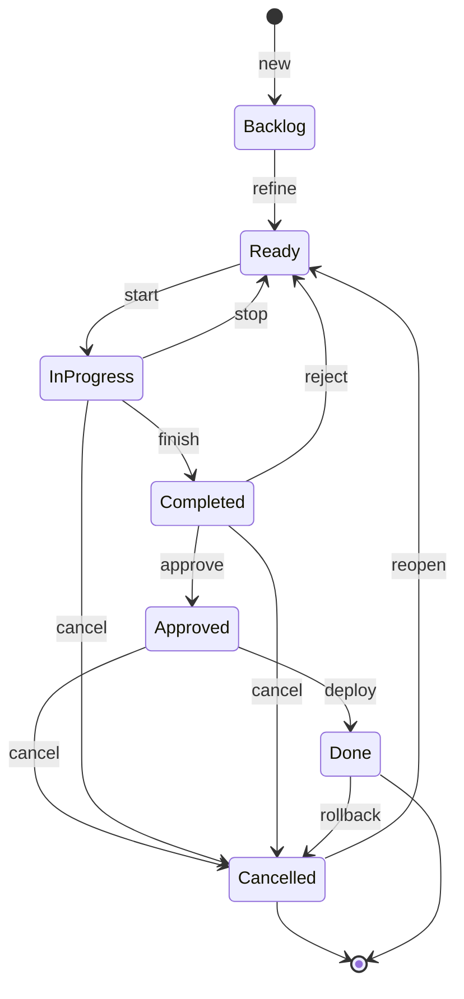
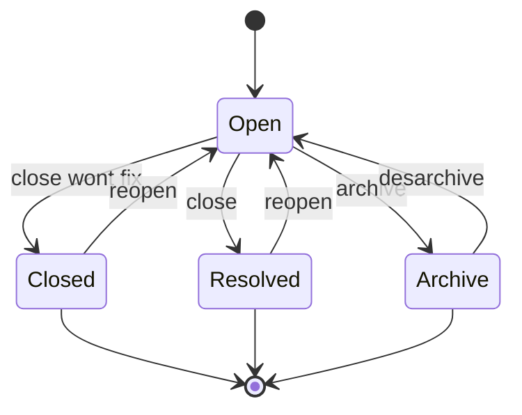

# Continious Integration con Scratchs de Salesforce

## Descripcion
Este modelo esta pensando para un desarrollo sobre Salesforce donde Github es e source of  Truth. Main representa produccion y cada requerimiento de desarrollo tiene su propia Feature Branch. 

* Source Control: Github
* Gestion de Proyecto: Github Project
* Branching Strategy: Github workflow
* Entorno de Desarrollo: Salesforce Scratchs Orgs con Tracking y deploys usando sf cli 
* Documentacion: Markdowns de Procesos con Github pages


## Acciones y subtareas

En la carpeta automation nos encontramos con scripts de acciones, que serian las acciones comunes que queremos automatizar dentro de nuestro proceso de desarrollo.

Asi identificamos las siguientes:

- [new](#new-crear-un-requerimiento-nuevo)
- [start](#start-iniciar-un-requerimiento-nuevo)
- [stop](#stop-poner-un-requerimiento-en-pausa-para-mas-tarde-o-bien-para-que-lo-tome-otro):
- [finish](#finish-al-terminar-el-desarrollo-de-un-requerimiento):
- [deploy](#deploy):
- [cancel](#cancel):
- [rollback](#rollback):



Mientras que los estados del Issue son:



## New: Crear un Requerimiento Nuevo

Crea un nuevo Issue y lo deja en Backlog

```
new (title, issueType)
└── create-issue ( title, issueType)
```

## Start: Iniciar un Requerimiento Nuevo

Si arrancamos de cero cuando llamamos a start, quien va a crear la branch y la scratch

```
start (issueNumber, issueType, dias=7)
├── validate-issue ( issueNumber, 'Ready')
├── create-branch ( issueNumber, nombreDelRequerimiento)
├── move-issue ( issueNumber, 'In Progress')
├── assign-user-issue ( issueNumber, me )
├── assign-branch-issue ( issueNumber, branch )
└── create-scracth ( issueNumber, nombreDelRequerimiento, dias)
```

Por ejemplo:

```
yarn auto start 32  bugfix-productDetail
```

## stop: Poner un requerimiento en pausa para mas tarde o bien para que lo tome otro

```
stop
├── validate-scratch ()
├── move-issue ( issueNumber, 'Ready')
├── label-issue ( issueNumber, 'motivo')
├── comment-issue ( issueNumber, 'comment')
└── publish-branch
```

## finish: Completar el desarrollo de un Requerimiento

```
finish
├── validate-scratch
├── validate-code
├── update-doc
├── publish-branch
├── create-pull-request ('main')
├── move-issue ( issueNumber, 'Completed' )
├── deploy-code ( issueNumber, 'qa')
├── sanity-test( 'qa')
└── drop-scracth
```

## Approve: Aprobar o validar el desarrollo del requerimiento

```
approved (issueNumber)
└── move-issue ( issueNumber, 'Approved')
```

## Reject: Desaprobar o reabrir un desarrollo

```
rejected (issueNumber)
└── move-issue ( issueNumber, 'Ready')
```

## Deploy:

```
deploy
├── validate-issue ('Approved')
├── deploy-code( 'prod')
├── sanity-test( 'prod')
├── merge-pull-request( )
├── close-pull-request
├── move-issue ('deployed')
└── drop-branch
```

## Cancel:

```
cancelled (issueNumber)
├── validate-issue ('Approved', 'Completed', 'Finished'  )
├── drop-branch
├── close-pull-request
├── comment-pull-request ( issueNumber, 'comment')
└── move-issue ( issueNumber, 'Cancelled')
```

## Rollback:

```
rollback (issueNumber)
├── reopen-pull-request
├── revert-commit
└── move-issue ( issueNumber, 'Cancelled')
```

## View

## List

## Switch
